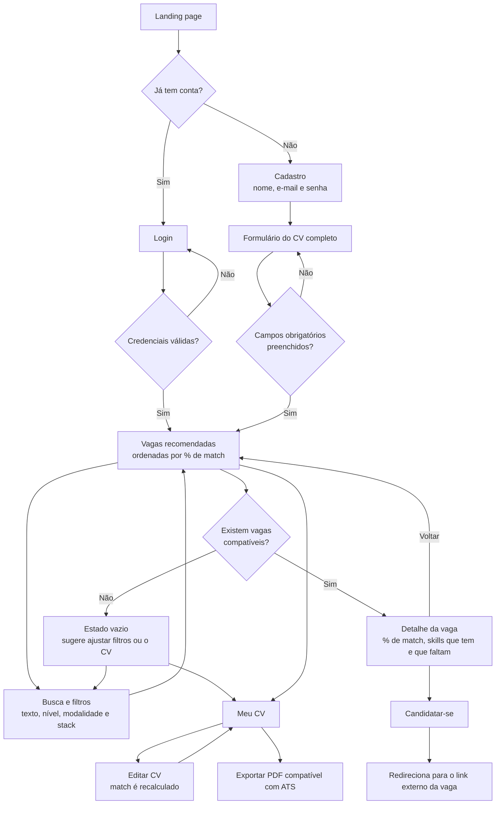
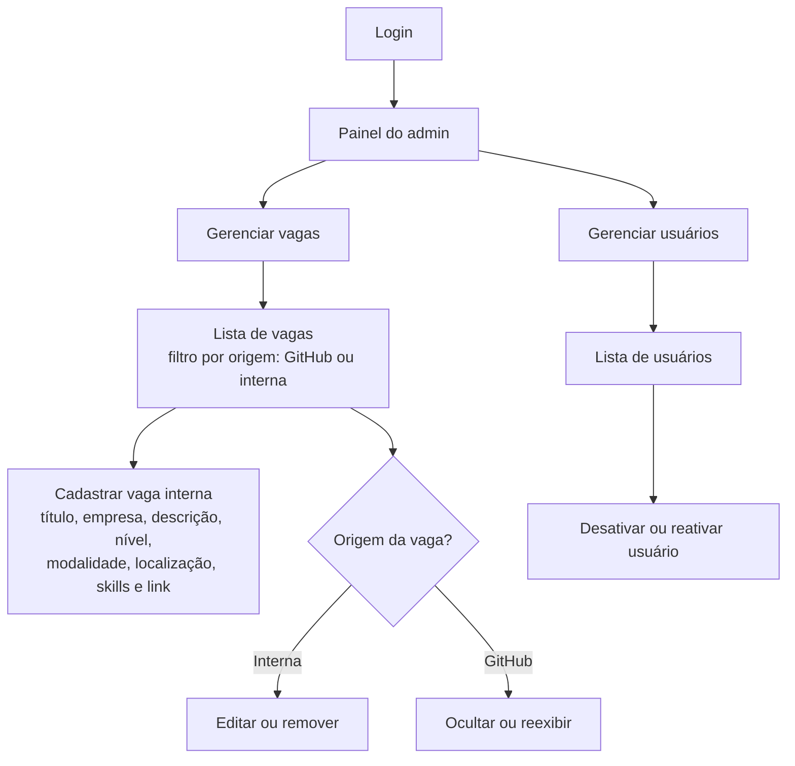
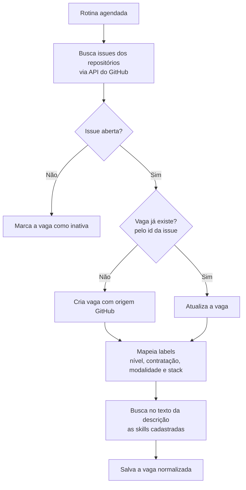

# Portal de Vagas: User Flows

Diagramas em Mermaid, renderizados direto pelo GitHub. Escopo completo em [mvp.md](./mvp.md).

## 1. Usuário (jornada principal)

Do cadastro até o redirecionamento para a vaga, passando pelo CV, pelo match e pela exportação do PDF.

## 2. Admin

Vagas importadas do GitHub não são editáveis, porque a sincronização sobrescreveria a edição. O admin só pode ocultá-las.

## 3. Sistema: sincronização das vagas do GitHub

Fluxo sem interação do usuário. Mostra como as vagas externas entram normalizadas no modelo híbrido.

## Telas para o protótipo

**Usuário:** landing page, cadastro, login, formulário do CV, vagas recomendadas (com busca e filtros), detalhe da vaga e Meu CV (edição e exportação).

**Admin:** login (o mesmo do usuário, com redirecionamento pelo papel), painel, lista de vagas, formulário de vaga interna e lista de usuários.
